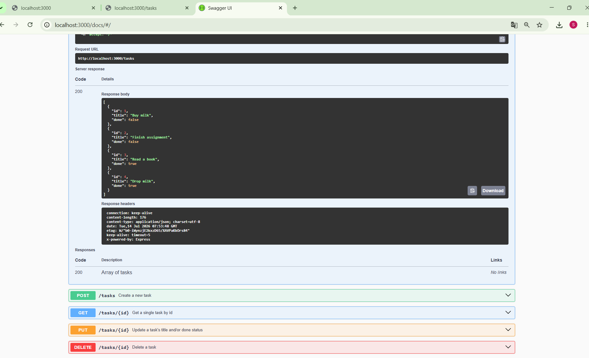

# Task API

A small in-memory CRUD API for managing a to-do list, built with Node.js and Express.
Data lives only in memory — it resets whenever the server restarts.

## How to run

```
npm install
npm start
```

The server starts on **http://localhost:3000**.
Interactive docs (Swagger UI): **http://localhost:3000/docs**

## Endpoints

| Method | Path         | Description                          | Success | Errors    |
|--------|--------------|---------------------------------------|---------|-----------|
| GET    | `/`          | API info                              | 200     | —         |
| GET    | `/health`    | Health check                          | 200     | —         |
| GET    | `/tasks`     | List all tasks                        | 200     | —         |
| GET    | `/tasks/:id` | Get a single task                     | 200     | 404       |
| POST   | `/tasks`     | Create a task (`{ "title": "..." }`)  | 201     | 400       |
| PUT    | `/tasks/:id` | Update `title` and/or `done`          | 200     | 400, 404  |
| DELETE | `/tasks/:id` | Delete a task                         | 204     | 404       |

## Example: create a task

```
curl -i -X POST http://localhost:3000/tasks -H "Content-Type: application/json" -d '{"title":"Learn Express"}'
```

```
HTTP/1.1 201 Created
Content-Type: application/json; charset=utf-8

{"id":4,"title":"Learn Express","done":false}
```

## Swagger UI screenshot



## The mortality experiment

After restarting the server, all tasks I had created during the previous run were gone, only the 3 original seed tasks remained. This happens because the task list lives only in the server's memory (RAM); when the Node.js process stops, that memory is wiped, and starting the process again re-runs the code from scratch, recreating only the hardcoded seed data. This is exactly why a real application needs a database to persist data beyond the process's lifetime.
