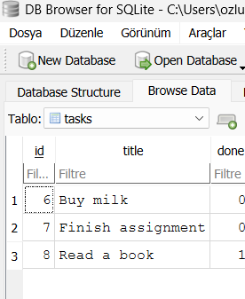

# Task API

A small in-memory CRUD API for managing a to-do list, built with Node.js and Express.
Data lives only in memory — it resets whenever the server restarts.

## How to run

```
npm install
npm start
```

The server starts on **http://localhost:3000**.
Interactive docs (Swagger UI): **http://localhost:3000/docs**

## Endpoints

| Method | Path         | Description                          | Success | Errors    |
|--------|--------------|---------------------------------------|---------|-----------|
| GET    | `/`          | API info                              | 200     | —         |
| GET    | `/health`    | Health check                          | 200     | —         |
| GET    | `/tasks`     | List all tasks                        | 200     | —         |
| GET    | `/tasks/:id` | Get a single task                     | 200     | 404       |
| POST   | `/tasks`     | Create a task (`{ "title": "..." }`)  | 201     | 400       |
| PUT    | `/tasks/:id` | Update `title` and/or `done`          | 200     | 400, 404  |
| DELETE | `/tasks/:id` | Delete a task                         | 204     | 404       |

## Example: create a task

```
curl -i -X POST http://localhost:3000/tasks -H "Content-Type: application/json" -d '{"title":"Learn Express"}'
```

```
HTTP/1.1 201 Created
Content-Type: application/json; charset=utf-8

{"id":4,"title":"Learn Express","done":false}
```

## Swagger UI screenshot


## The mortality experiment

After restarting the server, all tasks I had created during the previous run were gone, only the 3 original seed tasks remained. This happens because the task list lives only in the server's memory (RAM); when the Node.js process stops, that memory is wiped, and starting the process again re-runs the code from scratch, recreating only the hardcoded seed data. This is exactly why a real application needs a database to persist data beyond the process's lifetime.


## Week 3 — Connecting to SQLite

### Why SQLite
SQLite was chosen because it requires no separate server or installation — the entire
database lives in a single file (`tasks.db`) that is created automatically the first
time the app runs. This makes the project trivial for anyone to clone and run, while
still giving real persistence across restarts (unlike the in-memory version from
Assignment 1).

### Which library
The assignment recommends `better-sqlite3`, but installing it on this machine failed
because it needs to compile native code and Visual Studio Build Tools weren't
available on Windows. Instead, I used Node's built-in `node:sqlite` module
(`DatabaseSync`), which ships with Node.js itself (v22.13+/23.4+, no flag required)
and needs no native compilation. The API is very similar: `db.prepare(...).run(...)`,
`.get(...)`, `.all(...)`.

### Where the database lives
The database file is `tasks.db`, created automatically in the project root the first
time the server starts. It is listed in `.gitignore` so every clone starts with a
fresh database — the `tasks` table and its 3 seed rows are recreated automatically
because the code checks `SELECT COUNT(*) FROM tasks` and only seeds when the table is
empty.

### How to run
npm install
npm start
The server starts on **http://localhost:3000**, same as before.

### Example SQL query (Stage 4)
Using DB Browser for SQLite's "Execute SQL" tab, I ran:
```sql
UPDATE tasks SET done = 1;
DELETE FROM tasks WHERE done = 1;
```
This marked every task as completed and then deleted all of them, emptying the table.
Calling `GET /tasks` immediately afterward — without restarting the server — returned
an empty list, proving that the API and DB Browser read and write the exact same file.
Restarting the server then re-ran the seed logic (since the table was empty again),
recreating the 3 example tasks.

### DB Browser screenshot
